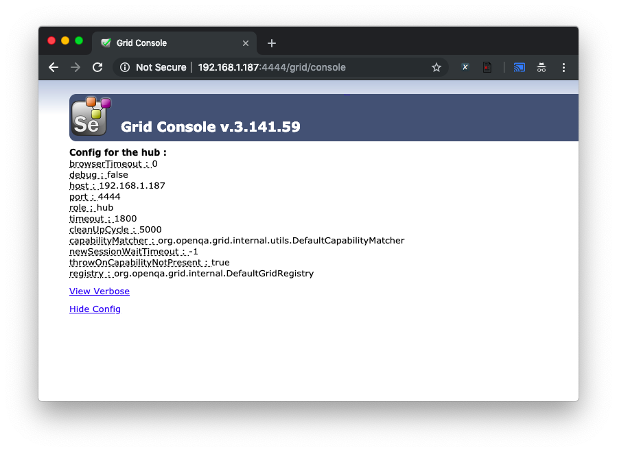
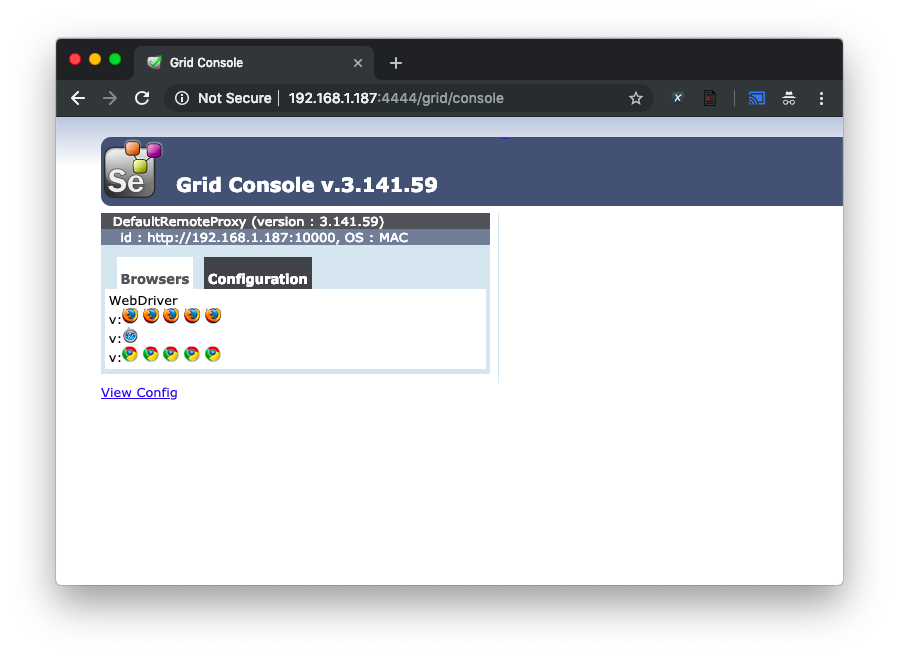

# training-selenium-201901

## Selenium Grid ##

Menjalankan Selenium Server sebagai Hub

        java -jar selenium-server.jar -role hub

Outputnya seperti ini

```
15:58:51.902 INFO [GridLauncherV3.parse] - Selenium server version: 3.141.59, revision: e82be7d358
15:58:52.141 INFO [GridLauncherV3.lambda$buildLaunchers$5] - Launching Selenium Grid hub on port 4444
2019-03-01 15:58:52.731:INFO::main: Logging initialized @1634ms to org.seleniumhq.jetty9.util.log.StdErrLog
15:58:53.319 INFO [Hub.start] - Selenium Grid hub is up and running
15:58:53.325 INFO [Hub.start] - Nodes should register to http://192.168.1.187:4444/grid/register/
15:58:53.327 INFO [Hub.start] - Clients should connect to http://192.168.1.187:4444/wd/hub
```

Buka console manajemen di [http://192.168.1.187:4444/grid/console](http://192.168.1.187:4444/grid/console)

[](docs/img/hub-console-1.png)

Menjalankan Selenium Server sebagai Node

        java -jar selenium-server-standalone-3.141.59.jar -role webdriver -hub http://
192.168.1.187:4444/grid/register -port 10000

Setelah terdaftar, akan terlihat di tampilan console hub

[](docs/img/hub-console-2.png)